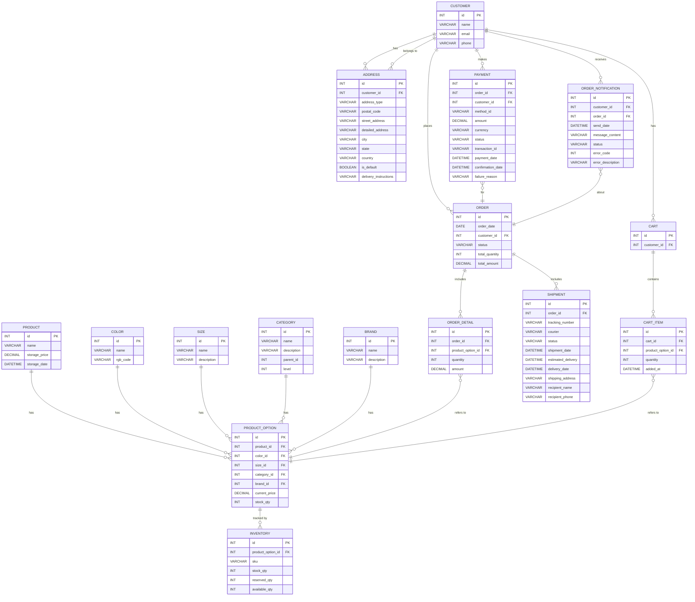

### 프로젝트 개요
이 프로젝트는 쇼핑 주문 서비스를 위한 마이크로서비스 아키텍처로 개발되었습니다. 각 서비스는 독립적으로 배포 가능하며, 전체 시스템은 다양한 비즈니스 로직을 분리하여 관리할 수 있도록 구성되었습니다.

### 프로젝트 구조
``` bash
├── api-gateway
│   ├── Dockerfile
│   └── build.gradle.kts
├── cart-service
│   ├── Dockerfile
│   └── build.gradle.kts
├── customer-service
│   ├── Dockerfile
│   └── build.gradle.kts
├── notification-service
│   ├── Dockerfile
│   └── build.gradle.kts
├── order-service
│   ├── Dockerfile
│   ├── build.gradle.kts
│   └── src
│       ├── main
│       │   ├── java
│       │   │   └── order
│       │   │       ├── OrderApplication.java
│       │   │       ├── controller
│       │   │       │   └── OrderController.java
│       │   │       ├── dto
│       │   │       │   ├── OrderRequest.java
│       │   │       │   └── OrderResponse.java
│       │   │       ├── entity
│       │   │       │   ├── Order.java
│       │   │       │   ├── OrderItem.java
│       │   │       │   └── OrderStatus.java
│       │   │       ├── repository
│       │   │       │   └── OrderRepository.java
│       │   │       └── service
│       │   │           └── OrderService.java
│       │   └── resources
│       │       └── application.yml
├── payment-service
│   ├── Dockerfile
│   └── build.gradle.kts
├── product-service
│   ├── Dockerfile
│   └── build.gradle.kts
└── shipping-service
    ├── Dockerfile
    └── build.gradle.kts
```
### 주요 서비스 설명
- **API Gateway:** 모든 요청을 중앙에서 처리하고 라우팅하는 게이트웨이 서비스입니다.
- **Cart Service:** 고객의 장바구니를 관리하는 서비스입니다.
- **Customer Service:** 고객의 정보를 관리하는 서비스입니다.
- **Notification Service:** 고객에게 알림을 보내기 위한 서비스입니다.
- **Order Service:** 주문 처리와 관련된 핵심 비즈니스 로직을 포함합니다. 주문 생성, 조회, 상태 업데이트 등을 관리합니다.
- **Payment Service:** 결제 처리를 담당하는 서비스입니다.
- **Product Service:** 제품 정보를 관리하는 서비스입니다.
- **Shipping Service:** 배송 정보를 관리하는 서비스입니다.
#### order-service는 다양한 패키지로 구분되어 있으며, 각 패키지는 특정 역할을 수행합니다:
- **controller:** HTTP 요청을 처리하고 응답을 반환합니다.
- **dto:** 데이터 전송 객체로, 요청과 응답 데이터를 포함합니다.
- **entity:** 데이터베이스 테이블과 매핑되는 엔터티 클래스입니다.
- **repository:** 데이터베이스와 상호작용하는 레포지토리 클래스입니다.
- **service:** 비즈니스 로직을 처리하는 서비스 클래스입니다.

### 테이블 ERD 작성
## ERD Diagram

