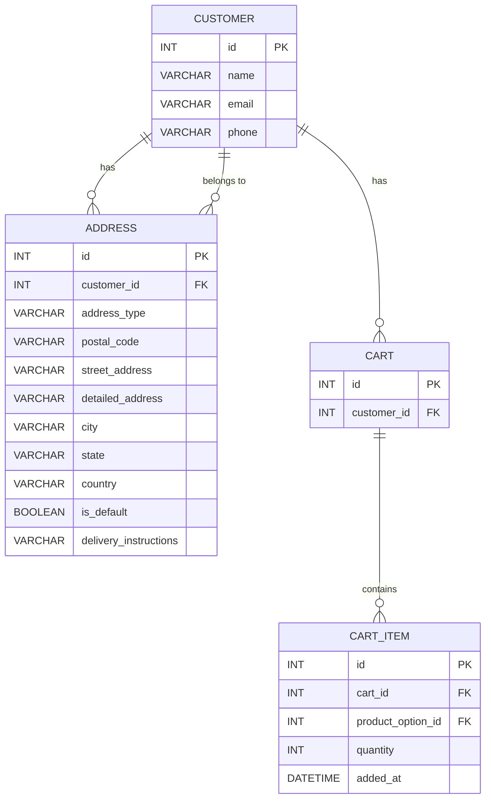
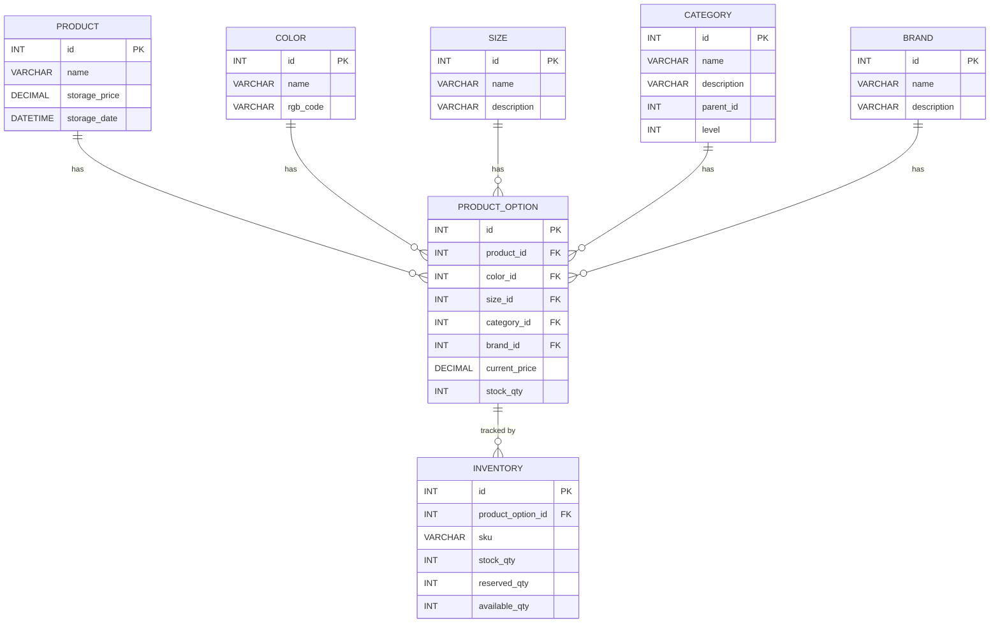
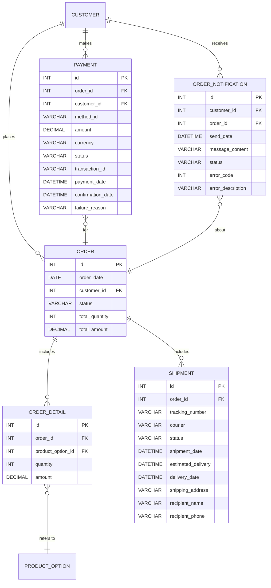

`shopping-service-order`는 쇼핑몰 주문 관리 기능을 담당하는 서비스로, 마이크로서비스 아키텍처(MSA)를 기반으로 설계되었습니다.
이 문서는 프로젝트의 내용과 로컬 환경에서 빌드하고 실행하는 방법을 작성했습니다.

## 목차
- [프로젝트 구조](#프로젝트-구조)
    - [주요 서비스 설명](#주요-서비스-설명)
- [시작하기](#시작하기)
    - [필수 요구 사항](#필수-요구-사항)
    - [설치 및 실행](#설치-및-실행)
- [빌드 및 실행](#빌드-및-실행)
- [테이블 ERD](#테이블-ERD)
    - [고객/주소/장바구니 보관](#고객/주소/장바구니-보관)
    - [상품/재고](#상품/재고)
    - [주문/결제/배송](#주문/결제/배송)

## 프로젝트 구조
<details>
  <summary>Click me</summary>
    
``` bash
shopping-service-order/
├── docker-compose.yml       # 전체 서비스 Docker 설정
├── api-gateway/             # API Gateway 서비스
│   ├── Dockerfile
│   ├── build.gradle.kts
│   └── src/
│       ├── main/
│       │   ├── java/
│       │   │   └── gateway/
│       │   │       └── ApiGatewayApplication.java
│       │   └── resources/
│       │       └── application.yml
│       └── test/
├── order-service/           # 주문 관리 서비스
│   ├── Dockerfile
│   ├── build.gradle.kts
│   └── src/
│       ├── main/
│       │   ├── java/
│       │   │   └── order/
│       │   │       ├── OrderApplication.java
│       │   │       ├── config/
│       │   │       │   └── RestTemplateConfig.java
│       │   │       ├── controller/
│       │   │       │   └── OrderController.java
│       │   │       ├── dto/
│       │   │       │   ├── OrderItemRequest.java
│       │   │       │   ├── OrderRequest.java
│       │   │       │   └── OrderResponse.java
│       │   │       ├── entity/
│       │   │       │   ├── Orders.java
│       │   │       │   ├── OrderDetail.java
│       │   │       │   └── OrderStatus.java
│       │   │       ├── repository/
│       │   │       │   ├── OrderRepository.java
│       │   │       │   └── OrderItemRepository.java
│       │   │       ├── service/
│       │   │       │   ├── OrderService.java
│       │   │       │   └── OrderStatusHistoryService.java
│       │   │       └── exception/
│       │   │           └── OrderNotFoundException.java
│       │   └── resources/
│       │       └── application.yml
│       └── test/
│           ├── java/
│           │   └── order/
│           │       └── OrderServiceTest.java
│           └── resources/
├── payment-service/         # 결제 관리 서비스
│   ├── Dockerfile
│   ├── build.gradle.kts
│   └── src/
│       ├── main/
│       │   ├── java/
│       │   │   └── payment/
│       │   │       ├── PaymentApplication.java
│       │   │       ├── config/
│       │   │       │   └── RestTemplateConfig.java
│       │   │       ├── controller/
│       │   │       │   └── PaymentController.java
│       │   │       ├── dto/
│       │   │       │   └── PaymentRequest.java
│       │   │       ├── entity/
│       │   │       │   ├── Payment.java
│       │   │       │   └── PaymentStatus.java
│       │   │       ├── repository/
│       │   │       │   └── PaymentRepository.java
│       │   │       └── service/
│       │   │           └── PaymentService.java
│       │   └── resources/
│       │       └── application.yml
│       └── test/
└── shared-dto/              # 공유 DTO 모듈
    ├── build.gradle.kts
    └── src/
        ├── main/
        │   ├── java/
        │   │   └── shared/
        │   │       └── dto/
        │   │           ├── OrderItemRequest.java
        │   │           ├── OrderRequest.java
        │   │           └── PaymentRequest.java
        │   └── resources/
        └── test/
```
</details>


### 주요 서비스 설명
- **API Gateway:** 모든 요청을 중앙에서 처리하고 라우팅하는 게이트웨이 서비스입니다.
- **Order Service:** 주문 처리와 관련된 핵심 비즈니스 로직을 포함합니다. 주문 생성, 조회, 상태 업데이트 등을 관리합니다.
- **Payment Service:** 결제 처리를 담당하는 서비스입니다.
- **shared-dto:** 여러 서비스 간에 공유되는 데이터 전송 객체(DTO)를 포함하는 모듈입니다.

## 시작하기

### 필수 요구 사항

이 프로젝트를 실행하려면 아래 소프트웨어가 필요합니다:
- **JDK 17** 이상
- **Gradle 7.0** 이상
- **H2** 데이터베이스
- **Git**

### 설치 및 실행

1. **Git 저장소 클론**:
   ```bash
   git clone https://github.com/dakcoh/shopping-service-order.git
   cd shopping-service-order

## 빌드 및 실행
> 기본적으로 애플리케이션은 http://localhost:8081에서 실행됩니다.
1. **프로젝트 빌드**
   ```bash
   ./gradlew build
2. **애플리케이션 실행**
   ```bash
   ./gradlew :order-service:bootRun

## 테이블 ERD
### 고객/주소/장바구니 보관 ERD

### 상품/재고 ERD


### 주문/결제/배송 ERD

